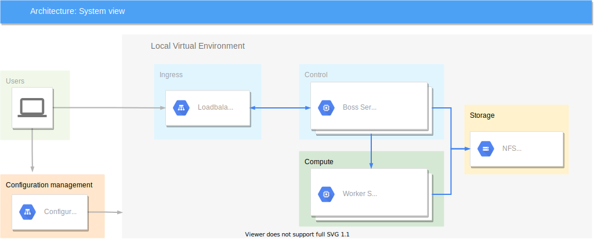

# Nainië (Lament)
This document aims to describe the Kubernetes PaaS service. It describes both
the general architecture and each component specifically. 

Our primary goal is to build a Highly-Available, configuration managed PaaS 
solution based on Kubernetes and Ranchers RKE2.

The main purpose of the project is to build a cluster that can be used for both
learning and for stable workloads. As a user of this service it has to be easy
to use, stable and available. The learning cluster does not requier any state
but the stable cluster will run applications that are stable. 

## Architecture
Basically this will be a standardised Kubernetes cluster with 3 "Boss" nodes
managing a number of "Worker" nodes. For API redundancy the services will be 
loadbalanced (Kubelet and Rancher RKE2-server) whilst all cluster traffic will
be managed by [MetalLB](https://metallb.universe.tf/). This will be managed by
the [Ansible](https://www.ansible.com/) configuration management system.

### Requierments
  * Highly Available
  * Separated Learning and Stable environments
  * Open-source software
  * Container based
  * Kubernetes

### System

#### Nodes
Nodes are installed by the automation and provides a basic platform for our 
automation via Ansible Roles.

##### Boss
Boss nodes runs the so called "control-plane" for Kubernetes and the server 
daemon for RKE2 clusters.

| Component | Value   |
| --------- | ------- |
| vCPU      | 2 cores |
| vRAM      | 4 GiB   |
| vHDD      | 40 GiB  |

##### Worker
Worker nodes will contain the Kubernetes compute components and deliver the 
actual applications hosted within the cluster.

| Component | Value    |
| --------- | -------- |
| vCPU      | 4 cores  |
| vRAM      | 8 GiB    |
| vHDD      | 100 GiB  |

#### Software
##### Rancher
###### containerd
###### RKE2
##### Loadbalancer
###### HAproxy
###### MetalLB
##### Ansible
###### Roles
###### Automation

## Configuration
